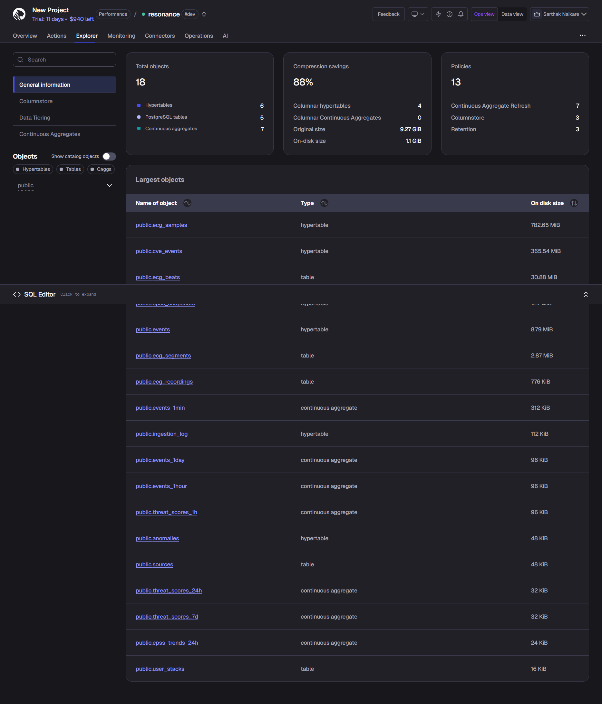
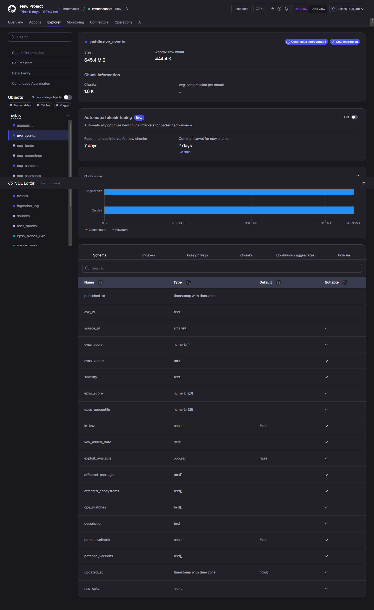
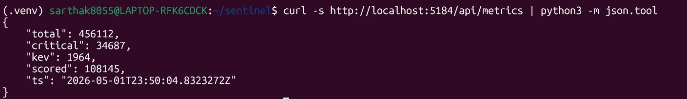
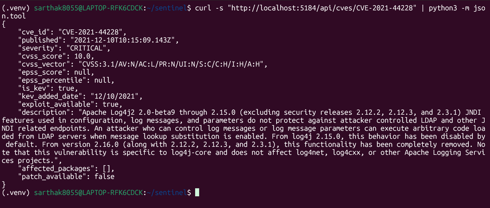
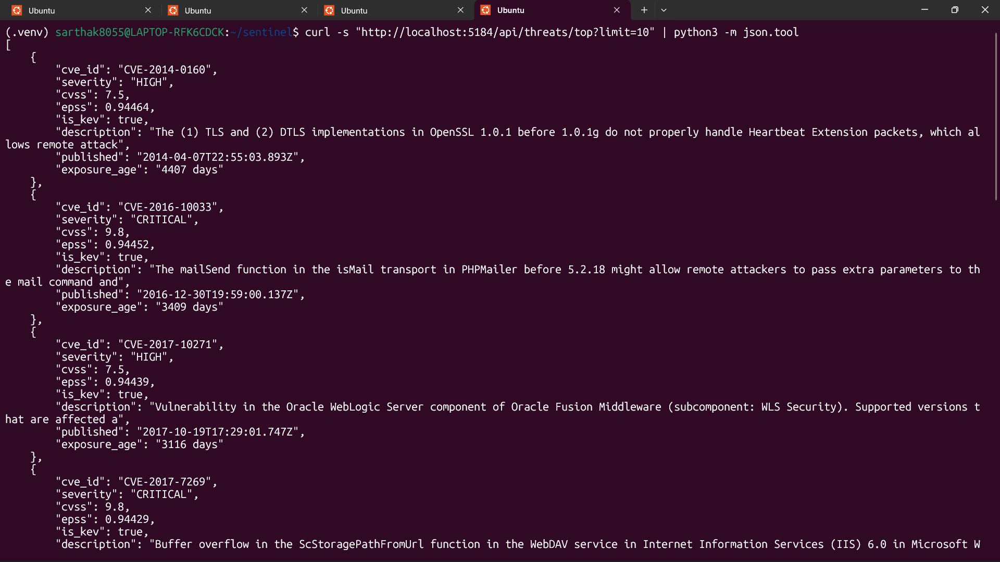
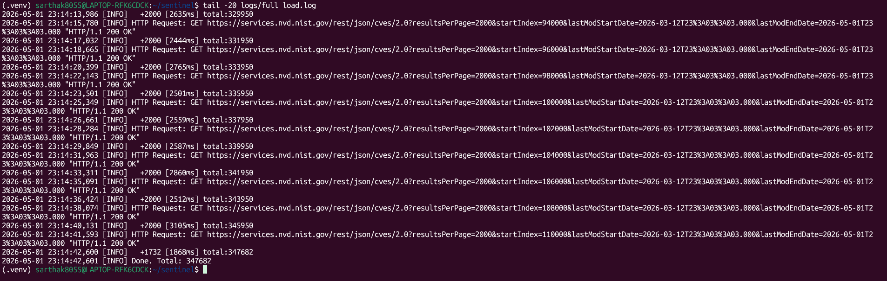
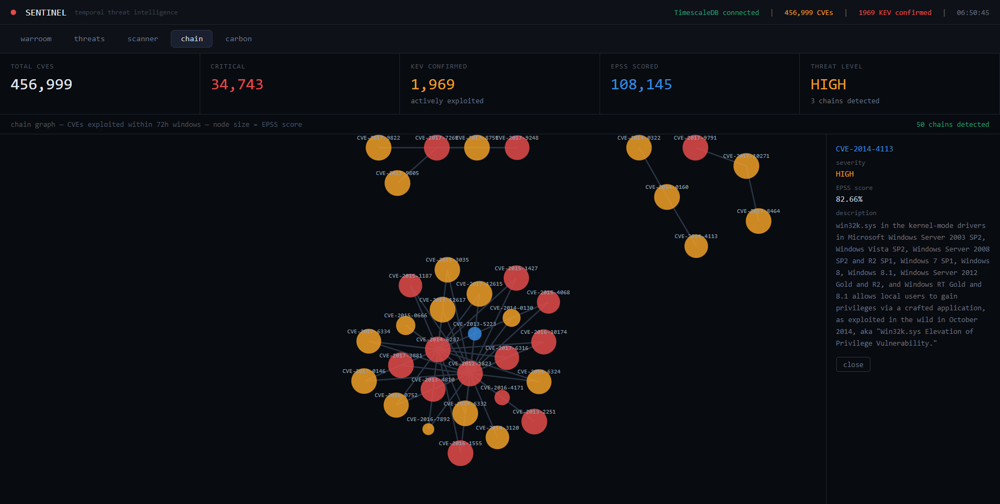

<div align="center">


# 🛡️ SENTINEL
### Temporal Threat Intelligence Engine

**The first CVE platform built natively on TimescaleDB.**
CVEs are not records. They are time-series events.

<br/>

[](https://www.timescale.com/)
[](https://dotnet.microsoft.com/)
[](https://python.org)
[](https://vitejs.dev/)
[](https://www.electronjs.org/)
[](https://sentinel-production-b4c7.up.railway.app/health)
[](https://sentinel-two-beta.vercel.app)

<br/>

[🌐 Live Dashboard](https://sentinel-two-beta.vercel.app) &nbsp;·&nbsp; [📥 Download App](https://sentinel-download.vercel.app) &nbsp;·&nbsp; [🔌 API Health](https://sentinel-production-b4c7.up.railway.app/health) &nbsp;·&nbsp; [📦 Releases](https://github.com/sarthakNaikare/sentinel/releases)

<br/>

> ⚠️ This product uses data from the NVD API but is not endorsed or certified by the NVD.

</div>

---

## 📊 Live Stats

<div align="center">

| 🔢 Total CVEs | 🔴 Critical | 🚨 KEV Confirmed | 📈 EPSS Scored | 💾 Compression |
|:---:|:---:|:---:|:---:|:---:|
| **456,999** | **34,743** | **1,969** | **108,145** | **88%** |

</div>

---

## 📸 Screenshots

### 🗄️ TimescaleDB Explorer — 88% compression, 1.6K chunks


### 📋 CVE Events Hypertable — 645 MiB, 444K rows


### 🔌 API — Live Metrics Endpoint


### 🔍 API — Log4Shell (CVE-2021-44228) Detail


### 🚨 API — Top Threats by EPSS + KEV


### 🔎 Stack Scanner — OSV Scan Results (Part 1)
.png)

### 🔎 Stack Scanner — OSV Scan Results (Part 2)
.png)

### ⚡ Full Load Complete — 347K CVEs ingested


### 🔗 Attack Chain Graph — D3.js Force Graph, 50 chains detected


---

## 🧠 What Makes SENTINEL Different?

Every existing CVE platform stores vulnerabilities as **static records**.

SENTINEL treats them as **time-series events** — tracking how dangerous each vulnerability becomes over time using EPSS trajectory, KEV confirmation, and temporal chain detection.

This is only possible with **TimescaleDB**.
Traditional CVE DB:  CVE → static record → query by ID
SENTINEL:            CVE → time-series event → trajectory, chains, carbon dating
---

## ✨ Core Features

### ☢️ Carbon Dating
Every CVE gets an **exposure age** computed from your deployment date, weighted by EPSS using TimescaleDB hyperfunctions. See exactly how long a vulnerability has been sitting in your stack — down to the day.

### 🔗 Attack Chain Detection
TimescaleDB window functions detect CVEs exploited together within **72-hour windows** historically. SENTINEL surfaces the full attack chain — not just individual vulnerabilities.

### 🎯 War Room Dashboard
Real-time threat heatmaps, live CVE feed ranked by KEV + EPSS, and a threat level indicator. All powered by continuous aggregates for sub-second queries on 456K+ records.

### 🔎 Stack Scanner
Drop in a `package.json`, `requirements.txt`, or `pom.xml`. SENTINEL resolves every dependency against OSV + NVD and returns a prioritised threat report enriched with EPSS scores and KEV flags.

### 🤖 AI Remediation
Claude-powered remediation guidance for any CVE. Context-aware patching recommendations and mitigation strategies generated in seconds.

### 📉 LEV Scoring
NIST 2025 Likely Exploited Vulnerabilities metric, computed natively using TimescaleDB hyperfunctions on historical EPSS snapshots.

---

## 📡 Data Sources

| Source | What it provides | Authority |
|--------|-----------------|----------|
| 🏛️ NVD API v2 | 456k+ CVEs, CVSS scores, KEV fields | US Gov — nist.gov |
| 🚨 CISA KEV | Confirmed in-the-wild exploits | US Gov — cisa.gov |
| 📊 EPSS | 30-day exploit probability scores | FIRST.org |
| 🔍 OSV.dev | Ecosystem package vulnerabilities | Google |
| 🐙 GitHub Advisory | Supply chain vulnerabilities | GitHub |

---

## 🏗️ Architecture
┌─────────────────────────────────────────────────────────────┐
│                        SENTINEL                             │
├─────────────┬───────────────┬──────────────┬───────────────┤
│  Python 3.12│   .NET 8 API  │  React+Vite  │   Electron    │
│  Ingestion  │   Railway     │   Vercel     │  Desktop App  │
│  ~100k/sec  │   /api/*      │  Dashboard   │  Win/Mac/Linux│
├─────────────┴───────────────┴──────────────┴───────────────┤
│                    TimescaleDB Cloud                        │
│  • cve_events hypertable    • threat_scores_1h cagg        │
│  • epss_snapshots           • threat_scores_24h cagg       │
│  • epss_trends_24h          • 88% compression              │
│  • 456,999 CVEs indexed     • 1,600+ chunks                │
└─────────────────────────────────────────────────────────────┘
---

## 🛠️ Tech Stack

| Layer | Technology | Purpose |
|-------|-----------|---------|
| 🗄️ **Database** | TimescaleDB 2.26.3 | Hypertables, caggs, Hypercore, retention |
| ⚙️ **API** | .NET 8 Minimal API | Npgsql, async, streaming — deployed on Railway |
| 🐍 **Ingestion** | Python 3.12 | asyncpg, COPY-based bulk insert ~100k rows/sec |
| ⚛️ **Frontend** | React + Vite + D3.js | War room, heatmap, chain graph — deployed on Vercel |
| 📦 **Desktop** | Electron 36 | Cross-platform installer, Keygen license management |
| 🔐 **Licensing** | Keygen.sh | License validation and access control |

---

## 🔌 API Endpoints

| Method | Endpoint | Description |
|--------|----------|-------------|
| `GET` | [`/health`](https://sentinel-production-b4c7.up.railway.app/health) | Service health check |
| `GET` | `/api/metrics` | Dashboard stats (total, critical, KEV, EPSS) |
| `GET` | `/api/cves` | Live CVE feed with filters |
| `GET` | `/api/cves/{cveId}` | Single CVE detail |
| `GET` | `/api/threats/top` | Top threats by EPSS + KEV |
| `GET` | `/api/heatmap` | 24h threat heatmap data |
| `GET` | `/api/carbon/{cveId}` | EPSS trajectory for a CVE |
| `GET` | `/api/chains` | Attack chain correlations |
| `POST` | `/api/remediate` | AI-powered remediation (Claude) |

**Base URL:** `https://sentinel-production-b4c7.up.railway.app`

---

## 📥 Download

<div align="center">

| Platform | Download | Size |
|----------|----------|------|
| 🐧 **Linux** | [SENTINEL-0.1.0.AppImage](https://github.com/sarthakNaikare/sentinel/releases/download/v0.2.2/SENTINEL-0.1.0.AppImage) | 108 MB |
| 🪟 **Windows** | [SENTINEL.Setup.0.1.0.exe](https://github.com/sarthakNaikare/sentinel/releases/download/v0.2.2/SENTINEL.Setup.0.1.0.exe) | 81.9 MB |
| 🍎 **macOS** | [SENTINEL-0.1.0-arm64.dmg](https://github.com/sarthakNaikare/sentinel/releases/download/v0.2.2/SENTINEL-0.1.0-arm64.dmg) | 101 MB |

Or visit the **[📥 Download Page →](https://sentinel-download.vercel.app)**

</div>

---

## 🚀 Local Development

### Prerequisites
- Python 3.12+
- .NET 8 SDK
- Node.js 20+
- TimescaleDB connection string

### Setup

```bash
# Clone the repo
git clone https://github.com/sarthakNaikare/sentinel.git
cd sentinel

# Set up Python environment
python -m venv .venv
source .venv/bin/activate
pip install -r requirements.txt

# Set environment variables
cp config/.env.example config/.env
# Edit config/.env with your TimescaleDB URL and Anthropic API key

# Run the API
cd api && export ANTHROPIC_API_KEY=your_key && dotnet run

# Run the frontend (new terminal)
cd frontend && npm install && npm run dev -- --host

# Run the Electron app (new terminal)
cd electron && npm install && npm start
```

---

## 🔒 Access & Licensing

SENTINEL uses **[Keygen.sh](https://keygen.sh)** for license management. Access is granted by the author on request.

- 📧 **Request access:** [sarthaknaikare@gmail.com](mailto:sarthaknaikare@gmail.com)
- 🌐 **Download page:** [sentinel-download.vercel.app](https://sentinel-download.vercel.app)
- 📦 **All releases:** [GitHub Releases](https://github.com/sarthakNaikare/sentinel/releases)

---

<div align="center">

Built by **[Sarthak Naikare](https://github.com/sarthakNaikare)**

[📧 Email](mailto:sarthaknaikare@gmail.com) &nbsp;·&nbsp; [🐙 GitHub](https://github.com/sarthakNaikare)

<br/>

*Powered by TimescaleDB · Deployed on Railway + Vercel*

</div>
